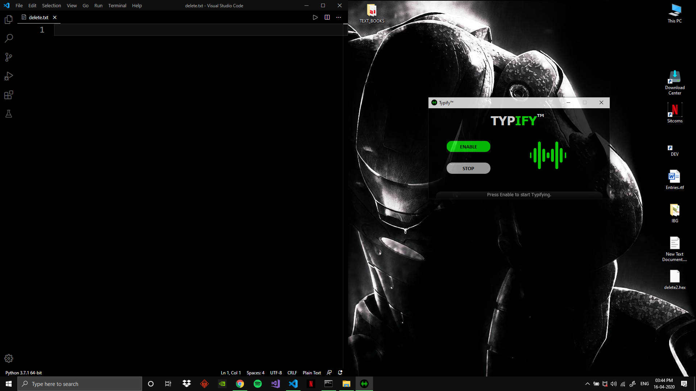

  
# **TYPIFY v1.0** 
 _A simple speech to text converter, that writes text wherever you want._

---

## **Dependencies**

### Python
 * Download and install Python from [here.](https://www.python.org/downloads/) 

### speech_recognition module
**For Windows 10, Mac OS and Linux**
Open the command prompt and paste the following command
<!--Github-->
```bash
pip3 install SpeechRecognition
```
### Qt FrameWork
<!--Github-->
**For Windows 10, Mac OS and Linux**
Open the command prompt and paste the following command
```bash
pip3 install pyqt5
```
---

## **Usage** :
>### Step 1 
>>**Open the app and press the "ENABLE" button to enable the listener.**

>### Step 2 
>>**Press the down arrow key before speaking the text that you want to be typed.**

>### Step 3 
>>**Place the cursor in any app or file, where you want it to be typed.**


---


